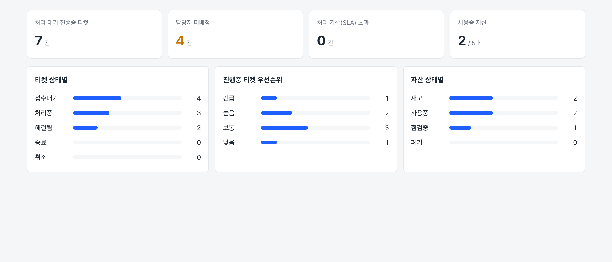
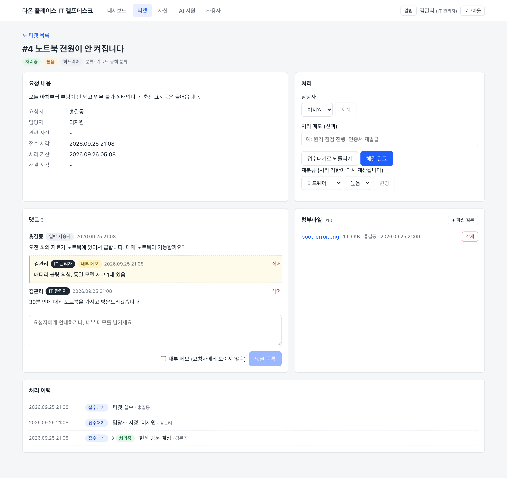
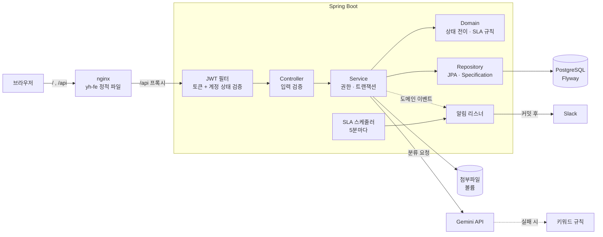

# IT 헬프데스크 & 자산관리

사내 IT 자산(노트북·모니터·라이선스)을 관리하고, 임직원의 장애·요청을 **티켓**으로 접수해 처리하는 서비스의 백엔드입니다.
티켓을 접수하면 **AI(Gemini)가 분류와 우선순위를 판단**하고, AI를 쓸 수 없을 때는 키워드 규칙으로 대체해 접수가 멈추지 않습니다.
처리 기한(SLA)이 다가오거나 지나면 담당자에게 알림(앱 + Slack)을 보냅니다.

> 프론트엔드: [yh-fe](https://github.com/OWNER/yh-fe) (React + TypeScript)

| 대시보드 | 티켓 상세 (자동 분류 · 처리 이력 · 댓글 · 첨부) |
|---|---|
|  |  |

## 한눈에 보기

| 항목 | 내용 |
|---|---|
| Stack | Java 17, Spring Boot 4.1, Spring Data JPA, Spring Security + JWT, OAuth2 Client(Google·Kakao·Naver), PostgreSQL 16, Flyway |
| AI | Google Gemini 2.5 Flash (JSON 응답) + 키워드 규칙 fallback |
| Test | JUnit 5, Mockito, MockMvc, **Testcontainers(PostgreSQL)** — 166개, 라인 커버리지 약 82% |
| Infra | Docker 멀티 스테이지 빌드, Docker Compose(DB·백엔드·nginx 프론트), GitHub Actions CI |

**핵심 설계 포인트**
1. **상태 전이는 도메인이 강제** — 엔티티에 setter 없이 `ticket.changeStatus()` 같은 메서드로만 변경. 허용되지 않은 전이는 `409`
2. **외부 AI 장애에 강한 접수** — 타임아웃·잘못된 응답·키 미설정 시 규칙 기반 분류로 대체. AI 호출은 **트랜잭션 밖**에서 해 DB 커넥션을 붙잡지 않음
3. **토큰 보안** — access token(30분)은 메모리, refresh token은 HttpOnly 쿠키 + DB에는 **해시만** 저장, 재발급 시 폐기(rotation). 비밀번호가 바뀌면 기존 access token도 즉시 거절. **SNS 로그인(Google·Kakao·Naver)도 같은 토큰 발급 로직**을 쓰고, 토큰을 URL 에 싣지 않음
4. **데이터 접근 범위** — 일반 사용자는 본인 티켓·자산만. 요청자는 요청 본문이 아닌 **토큰에서** 결정
5. **운영과 같은 환경으로 테스트** — H2 대신 실제 PostgreSQL 컨테이너, 스키마는 Flyway로만 관리(`ddl-auto=validate`)

## 구조



## 실행

### Docker로 전체 실행 (DB + 백엔드 + 프론트엔드)

```bash
# 두 저장소를 같은 폴더에 받는다 (다른 위치라면 .env 의 FRONTEND_PATH 로 지정)
git clone https://github.com/OWNER/toy-pj.git
git clone https://github.com/OWNER/yh-fe.git
cd toy-pj

cp .env.example .env
# .env 의 JWT_SECRET 채우기:  openssl rand -base64 32  결과를 붙여넣기
docker compose up -d --build
```

| 주소 | 내용 |
|---|---|
| http://localhost:3000 | 화면 |
| http://localhost:8081/swagger-ui.html | API 문서 |

데모 계정: **IT 관리자** `admin@daon.example` / `admin1234`, **일반 사용자** `hong@daon.example` / `user1234`

- `.env` 의 `GEMINI_API_KEY` 가 없으면 키워드 규칙으로 분류합니다. `SLACK_WEBHOOK_URL` 을 넣으면 SLA 알림이 Slack 으로도 갑니다.
- 외부에 공개할 때는 `.env` 에서 `SEED_DATA=false` (데모 계정 생성 안 함)

### IntelliJ로 백엔드만 실행 (개발)

- 로컬 PostgreSQL 의 `yh_toy` DB 를 사용합니다. 테이블은 앱이 시작할 때 Flyway 가 만듭니다.
- `local` 프로필에 개발용 JWT 키와 샘플 데이터가 설정되어 있어 추가 설정 없이 실행됩니다.
- AI 기능: 실행 설정의 Environment variables 에 `GEMINI_API_KEY=...`
- SNS 로그인: 같은 곳에 `GOOGLE_CLIENT_ID`, `GOOGLE_CLIENT_SECRET` (Kakao·Naver 도 같은 형식). 개발자 콘솔 콜백 주소는 `http://localhost:5173/login/oauth2/code/google` (프론트 개발 서버 경유)
- 프론트엔드: `yh-fe` 에서 `npm run dev` → http://localhost:5173

### 테스트

```bash
./gradlew test      # Docker 필요: 테스트용 PostgreSQL 컨테이너를 자동으로 띄우고 끝나면 정리
```
커버리지 리포트: `build/reports/jacoco/test/html/index.html`

## 주요 기능

### 티켓 (헬프데스크)
- 접수 → 담당자 지정 → 처리 → 해결 → 종료의 **상태 머신**을 도메인에서 강제
- **자동 분류(Triage)**: AI가 분류·우선순위를 판단, 실패 시 키워드 규칙으로 대체. 일반 사용자는 우선순위를 직접 고를 수 없음(자동 분류 → 담당자 재분류)
- **SLA**: 우선순위별 처리 기한 자동 계산(긴급 4h / 높음 8h / 보통 24h / 낮음 72h), 기한 초과 여부 표시
- **처리 이력**: 상태 변경·담당자 지정·재분류가 처리자와 함께 모두 이력으로 남음
- **댓글**: 요청자 ↔ 담당자 소통. 관리자끼리만 보는 **내부 메모**. 종료된 티켓에는 작성 불가
- **첨부파일**: 스크린샷·PDF·로그 (png, jpg, gif, webp, pdf, txt, log / 5MB / 티켓당 10개)
- 상태/우선순위/분류/담당자/미배정/키워드 조건 **동적 검색 + 페이징**

### 자산
- 등록(재고) → 배정(사용중) → 반납 / 점검 / 폐기 흐름을 도메인 메서드로 제어
- 시리얼 번호 중복 방지, 사용중·티켓 이력이 있는 자산 삭제 방지

### 알림
- **앱 내 알림** (상단 알림 버튼): 담당 배정, 새 댓글, SLA 임박, SLA 초과
- **SLA 알림**: 5분마다 점검 → 기한 **1시간 전** "임박", 기한이 지나면 "초과". 담당자에게, 담당자가 없으면 IT 관리자 전체에게
- 같은 기한에 대해 한 번만 보내고, 재분류로 기한이 바뀌면 다시 보냄
- 긴급 알림(SLA)은 **Slack Webhook** 으로도 발송 (설정 시)

### 대시보드 · 공통
- 티켓 상태별/진행중 우선순위별 건수, 미배정 건수, SLA 초과 건수, 자산 상태별 건수
- `/api/codes`: 프론트엔드 드롭다운용 코드-한글 라벨 목록

## 문서

| 문서 | 내용 |
|---|---|
| [인증 · 보안](docs/security.md) | 로그인·토큰 재발급 흐름, SNS 로그인, 해시 저장, 로그인 잠금, 토큰 무효화, 권한표 |
| [도메인 모델 · 패키지 구조](docs/architecture.md) | ERD, 티켓 상태 전이, 패키지 구성, Flyway 마이그레이션 |
| [API 요약](docs/api.md) | 엔드포인트 목록, 에러 응답 포맷과 코드 |
| [설계 결정과 이유](docs/design-decisions.md) | "왜 이렇게 했는가" 30여 가지 |
| [테스트 전략](docs/testing.md) | 테스트 종류별 대상, **테스트·점검으로 발견해 고친 버그** |
| [개선 이력](docs/history.md) | 처음 프로젝트에서 무엇을 어떻게 바꿨는지 |

## 향후 과제
- **클라우드 배포**: 이미지를 레지스트리(GHCR/ECR)에 올리고 VM(EC2 등)에서 compose 로 실행, HTTPS 는 리버스 프록시(Caddy/nginx + Let's Encrypt)로 처리
- **서버 여러 대로 확장할 때**: 스케줄러 중복 실행 방지(ShedLock), 첨부파일 저장소를 S3 로 교체(`FileStorage` 구현체만 추가)
- **실시간 알림**: 지금은 60초마다 조회(polling) → SSE/WebSocket
- **AI 분류 정확도 측정**: `classificationSource=AI` 티켓 중 재분류 비율 모니터링
- **AI 채팅 사용량 제한**: 사용자별 요청 횟수 제한(rate limit)으로 외부 API 비용 보호
- **refresh token 재사용 탐지**: 이미 사용한 토큰이 다시 오면 탈취로 보고 해당 사용자의 모든 세션 폐기
- **SNS 계정 연결**: 이메일로 가입한 사용자가 로그인한 상태에서 SNS 계정을 추가로 연결 (지금은 같은 이메일이면 자동 연결하지 않고 거부)
- **서버 여러 대에서 SNS 로그인**: 로그인 중 잠깐 보관하는 state 를 세션 대신 쿠키에 두는 `AuthorizationRequestRepository` 구현
