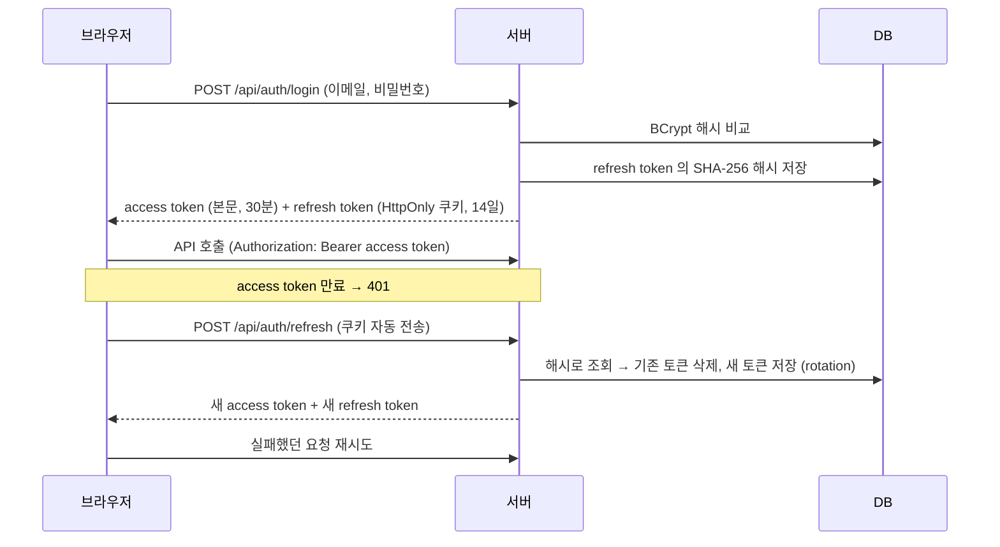
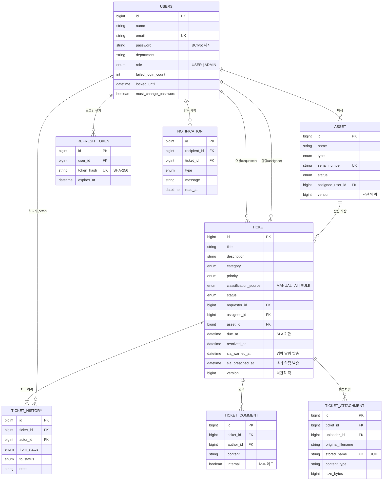
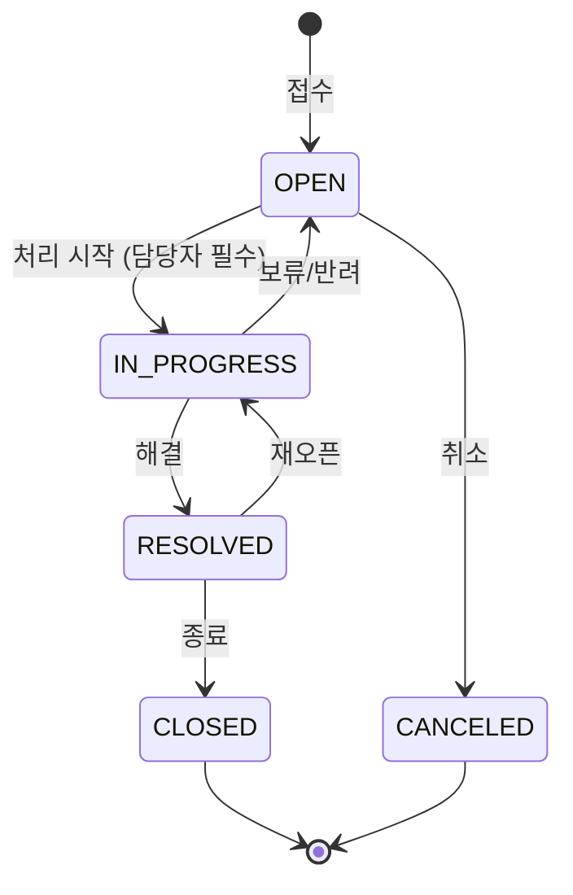

# IT 헬프데스크 & 자산관리 API

사내 IT 자산(노트북·모니터·라이선스 등)을 관리하고, 임직원의 장애/요청을 **티켓**으로 접수·처리하는 백엔드 API입니다.
티켓 접수 시 **Gemini AI가 분류와 우선순위를 자동으로 판단**하고, AI를 사용할 수 없을 때는 키워드 규칙으로 대체해 서비스가 멈추지 않도록 설계했습니다.
요청자와 담당자는 **댓글·첨부파일**로 소통하고, 처리 기한이 다가오면 **SLA 알림**(앱 내 알림 + Slack)을 받습니다.

| 항목 | 내용 |
|---|---|
| Language | Java 17 |
| Framework | Spring Boot 4.1, Spring Data JPA (Hibernate 7), Bean Validation |
| Security | Spring Security 7, JWT (jjwt), BCrypt |
| DB | PostgreSQL 16, **Flyway** (스키마 버전 관리) |
| AI | Google Gemini 2.5 Flash (REST, structured JSON output) |
| Docs | springdoc-openapi (Swagger UI) |
| Test | JUnit 5, AssertJ, Mockito, MockMvc, `@DataJpaTest`, **Testcontainers (PostgreSQL)**, JaCoCo |
| Observability | 요청 ID(MDC) 로그 추적, 요청별 접근 로그, Actuator health |
| Infra | Docker (멀티 스테이지 빌드), Docker Compose, nginx |
| CI | GitHub Actions (테스트 + Docker 이미지 빌드) |

---

## 1. 실행 방법

### A. Docker 로 전체 실행 (DB + 백엔드 + 프론트엔드)

```bash
cp .env.example .env
# .env 의 JWT_SECRET 채우기:  openssl rand -base64 32  결과를 붙여넣기
docker compose up -d --build
```

| 주소 | 내용 |
|---|---|
| http://localhost:3000 | 화면 (프론트엔드 `../yh-fe` 를 빌드해 nginx 로 서빙) |
| http://localhost:8081/swagger-ui.html | API 문서 |

데모 계정: **IT 관리자** `admin@daon.example` / `admin1234`, **일반 사용자** `hong@daon.example` / `user1234`
(외부에 공개할 때는 `.env` 에서 `SEED_DATA=false`)

- 첨부파일은 Docker 볼륨(`uploads`)에 저장되어 컨테이너를 다시 만들어도 유지됩니다.
- `.env` 에 `SLACK_WEBHOOK_URL` 을 넣으면 SLA 임박·초과 알림이 Slack 채널로도 갑니다.

### B. IntelliJ 로 백엔드만 실행 (개발)

- 로컬 PostgreSQL 의 `yh_toy` DB 를 사용합니다. 테이블은 Flyway 가 자동으로 만듭니다.
- `local` 프로필에는 개발용 JWT 키와 샘플 데이터가 설정되어 있어 추가 설정 없이 실행됩니다.
- AI 기능: 실행 설정의 Environment variables 에 `GEMINI_API_KEY=...` (없으면 키워드 규칙으로 동작)
- 프론트엔드: `../yh-fe` 에서 `npm run dev` → http://localhost:5173

- 첨부파일은 프로젝트 폴더의 `data/uploads` 에 저장됩니다. (git 에서 제외)
- 이미 V1 스키마로 쓰던 DB 는 서버를 다시 시작하면 Flyway 가 V2~V5 를 자동으로 적용합니다. (기존 데이터 유지)

> **Flyway 도입 전(Hibernate 가 테이블을 만들던 시절) DB 를 쓰고 있었다면** 기존 테이블을 한 번 지워야 합니다.
> `psql -U postgres -c "DROP DATABASE yh_toy" -c "CREATE DATABASE yh_toy"`

### 테스트

```bash
./gradlew test      # Docker 필요: 테스트용 PostgreSQL 컨테이너를 자동으로 띄우고 끝나면 정리
```
커버리지 리포트: `build/reports/jacoco/test/html/index.html`

---

## 2. 인증 · 보안

### 로그인 흐름



### DB 에는 해시만 저장

| 값 | 저장 방식 | 이유 |
|---|---|---|
| 비밀번호 | **BCrypt** (`{bcrypt}$2a$10$...`) | 사람이 정한 값이라 추측 가능 → 일부러 느린 해시 + 사용자마다 다른 salt 로 대입 공격을 어렵게 함. 같은 비밀번호도 해시가 매번 다름 |
| refresh token | **SHA-256** (64자리) | 서버가 만든 256비트 무작위 값이라 추측 불가 → 빠른 해시로 충분하고, 값이 고정이라 DB 인덱스로 바로 조회 가능 |
| access token | 저장 안 함 | 서명(HS256)으로 위변조를 검증하므로 서버가 보관할 필요 없음 (STATELESS) |

DB 가 유출되더라도 해시로는 원래 비밀번호나 토큰을 알아낼 수 없습니다.

### 로그인 시도 제한 · 비밀번호 관리

| 기능 | 동작 |
|---|---|
| **로그인 시도 제한** | 같은 계정으로 **5번 연속** 틀리면 **15분 잠금** (`423 AUTH005`). 잠긴 동안에는 맞는 비밀번호도 거절. 성공하면 실패 횟수 초기화 |
| **비밀번호 변경** | 현재 비밀번호를 다시 확인 → 변경 후 **다른 기기의 로그인(refresh token)은 모두 폐기**, 지금 기기에만 새 토큰 발급 |
| **관리자 비밀번호 초기화** | 12자리 임시 비밀번호 발급 (응답에서 **한 번만** 확인 가능, DB 에는 해시). 잠금 해제 + 기존 로그인 폐기 + 다음 로그인 때 **변경 강제** |
| **관리자 잠금 해제** | 15분을 기다리지 않고 즉시 해제 |

> 트레이드오프: 잠금 안내(423)는 "이 이메일의 계정이 존재한다"는 사실을 드러냅니다. 계정 존재 여부를 완전히 숨기는 것보다, 사용자가 왜 로그인이 안 되는지 알 수 있는 쪽을 택했습니다.
> access token(JWT)은 서버가 취소할 수 없어, 비밀번호를 바꿔도 이미 발급된 access token 은 최대 30분 동안 유효합니다. (짧은 만료 시간으로 위험을 제한)

### 권한

| 기능 | 일반 사용자(USER) | IT 관리자(ADMIN) |
|---|---|---|
| 티켓 접수 | O (요청자 = 로그인 사용자) | O |
| 티켓 조회 | **본인이 요청한 티켓만** | 전체 |
| 티켓 상태 변경 | 본인 티켓 **취소만** | 전체 (허용된 전이) |
| 담당자 지정 · 재분류 | X | O |
| 자산 조회 | **본인에게 배정된 자산만** | 전체 |
| 자산 등록 · 배정 · 폐기 | X | O |
| 댓글 | 본인 티켓에 작성·조회 | 전체 + **내부 메모**(요청자에게 안 보임) |
| 첨부파일 | 본인 티켓에 업로드·다운로드, 본인 파일 삭제 | 전체 |
| 알림 | 본인 알림만 | 본인 알림만 |
| 대시보드 · 사용자 관리 · 비밀번호 초기화 | X | O |

- URL 단위 규칙은 `SecurityConfig`, "본인 데이터만" 같은 데이터 단위 규칙은 서비스/도메인에서 검사합니다.
- 로그인 안 함 → `401 AUTH001`, 권한 없음 → `403 AUTH004` (다른 에러와 같은 JSON 포맷)
- 처리 이력에는 **누가** 변경했는지(처리자)가 함께 기록됩니다.

---

## 3. 핵심 기능

### 티켓 (헬프데스크)
- 접수 → 담당자 지정 → 처리 → 해결 → 종료의 **상태 머신**을 도메인에서 강제
- **자동 분류(Triage)**: 분류/우선순위를 비워서 접수하면 AI가 판단, 실패 시 키워드 규칙으로 대체
- **SLA**: 우선순위별 처리 기한 자동 계산(긴급 4h / 높음 8h / 보통 24h / 낮음 72h), 기한 초과 여부 표시
- **처리 이력**: 상태 변경·담당자 지정·재분류가 처리자와 함께 모두 이력으로 남음
- **댓글**: 요청자 ↔ 담당자 소통. 관리자끼리만 보는 **내부 메모**. 종료된 티켓에는 작성 불가
- **첨부파일**: 스크린샷·PDF·로그 (png, jpg, gif, webp, pdf, txt, log / 5MB / 티켓당 10개)
- 상태/우선순위/분류/담당자/미배정/키워드 조건 **동적 검색 + 페이징**

### 자산
- 등록(재고) → 배정(사용중) → 반납 / 점검 / 폐기 흐름을 도메인 메서드로 제어
- 시리얼 번호 중복 방지, 사용중·티켓 이력이 있는 자산 삭제 방지

### 알림
- **앱 내 알림** (상단 알림 버튼): 담당 배정, 새 댓글, SLA 임박, SLA 초과
- **SLA 알림**: 5분마다 점검 → 기한 **1시간 전** "임박", 기한이 지나면 "초과". 담당자에게, 담당자가 없으면 IT 관리자 전체에게
- 같은 기한에 대해 한 번만 보내고, 재분류로 기한이 바뀌면 다시 보냄
- 긴급 알림(SLA)은 **Slack Webhook** 으로도 발송 (설정 시)

### 대시보드 · 공통
- 티켓 상태별/진행중 우선순위별 건수, 미배정 건수, SLA 초과 건수, 자산 상태별 건수
- `/api/codes`: 프론트엔드 드롭다운용 코드-한글 라벨 목록

---

## 4. 도메인 모델



### 티켓 상태 전이



허용되지 않은 전이(예: `OPEN → CLOSED`)는 `409 T002` 로 거부됩니다. 상세 조회 응답의 `nextStatuses` 로 화면에서 가능한 버튼만 노출할 수 있습니다.

---

## 5. 패키지 구조

```
com.yh.toy_pj
├── domain                 # 업무 도메인별 수직 분할 (Controller → Service → Repository → Entity)
│   ├── ticket             # Ticket, TicketHistory, 상태/우선순위/분류 enum, Specification 검색
│   │   ├── comment        # 댓글 / 내부 메모
│   │   └── attachment     # 첨부파일 (파일 형식 검증, 저장소 연동)
│   ├── asset
│   ├── user
│   ├── dashboard          # GROUP BY 집계 기반 통계
│   └── code               # 공통 코드 API
├── auth                   # 로그인/재발급/로그아웃, JWT 발급·검증 필터, refresh token(해시 저장)
├── notification           # 앱 내 알림, 티켓 이벤트 리스너, SLA 점검(SlaMonitor), 스케줄러, Slack 발송
├── ai                     # GeminiClient, TicketTriageService(AI → 규칙 fallback), RuleBasedTriage
├── global
│   ├── error              # ErrorCode, BusinessException, GlobalExceptionHandler, ErrorResponse
│   ├── security           # SecurityConfig(URL 권한 규칙), 401/403 응답 처리
│   ├── logging            # RequestIdFilter (요청 ID → MDC·응답 헤더·에러 응답, 접근 로그)
│   ├── storage            # FileStorage 추상화 + LocalFileStorage
│   ├── common             # BaseTimeEntity(Auditing), PageResponse, CodeEnum
│   └── config             # JPA Auditing(Clock 기준), Clock, OpenAPI, Scheduling
└── support                # local 프로필 샘플 데이터
```

---

### DB 스키마 버전 관리 (Flyway)

테이블 구조는 `src/main/resources/db/migration` 의 SQL 파일로만 관리합니다.

```
db/migration                         ← 앱 시작 시 Flyway 가 아직 적용 안 된 파일만 순서대로 실행
├── V1__init_schema.sql              사용자, 자산, 티켓, 처리 이력, refresh token
├── V2__account_security.sql         로그인 실패 횟수·잠금, 비밀번호 변경 관련 컬럼
├── V3__ticket_comment_attachment.sql 댓글, 첨부파일
├── V4__notification_sla.sql         알림, SLA 알림 발송 기록 컬럼
└── V5__normalize_user_email.sql     기존 이메일을 소문자로 통일
```

- 실행 이력은 `flyway_schema_history` 테이블에 남습니다. 어느 서버든 "지금 DB 가 몇 번 버전인지" 알 수 있습니다.
- Hibernate 는 `ddl-auto=validate` 로 **엔티티와 테이블이 일치하는지 검증만** 합니다. 불일치하면 앱이 뜨지 않습니다.
- 테스트도 **실제 PostgreSQL 컨테이너**에 같은 마이그레이션을 적용해 스키마를 만들어, SQL 과 엔티티가 어긋나면 테스트가 실패합니다.
- **이미 적용된 파일은 수정하지 않습니다.** 변경이 필요하면 V2~V5 처럼 새 파일을 추가합니다. 기존 운영 DB 에도 데이터 손실 없이 순서대로 적용됩니다.

---

## 6. API 요약

| Method | URL | 설명 |
|---|---|---|
| POST | `/api/auth/signup` | 회원가입 (USER) |
| POST | `/api/auth/login` | 로그인 → access token + refresh token 쿠키 |
| POST | `/api/auth/refresh` | 토큰 재발급 (rotation) |
| POST | `/api/auth/logout` | 로그아웃 (refresh token 폐기) |
| GET | `/api/auth/me` | 내 정보 |
| PATCH | `/api/auth/password` | 비밀번호 변경 (다른 기기 로그인 해제) |
| POST | `/api/users` | 사용자 등록 (관리자 포함, ADMIN 전용) |
| GET | `/api/users`, `/api/users/{id}` | 사용자 조회 (ADMIN 전용) |
| POST | `/api/users/{id}/password-reset` · `/unlock` | 임시 비밀번호 발급 · 잠금 해제 (ADMIN 전용) |
| POST | `/api/assets` | 자산 등록 (재고 상태) |
| GET | `/api/assets?status=&type=&assignedUserId=&keyword=&page=&size=&sort=` | 자산 검색 |
| GET / PATCH / DELETE | `/api/assets/{id}` | 조회 / 부분 수정 / 삭제 |
| POST | `/api/assets/{id}/assign` · `/return` · `/repair` · `/repair/complete` · `/dispose` | 배정 · 반납 · 점검 · 점검완료 · 폐기 |
| POST | `/api/tickets` | 티켓 접수 (category/priority 생략 시 자동 분류) |
| GET | `/api/tickets?status=&priority=&category=&requesterId=&assigneeId=&unassigned=&keyword=` | 티켓 검색 |
| GET | `/api/tickets/{id}` | 상세 (처리 이력, 가능한 다음 상태 포함) |
| POST | `/api/tickets/{id}/assign` | 담당자 지정 (ADMIN 만) |
| PATCH | `/api/tickets/{id}/status` | 상태 변경 |
| PATCH | `/api/tickets/{id}/classification` | 재분류 (SLA 재계산) |
| GET / POST | `/api/tickets/{id}/comments` | 댓글 목록 / 작성 (`internal` = 내부 메모) |
| DELETE | `/api/tickets/{id}/comments/{commentId}` | 댓글 삭제 (작성자) |
| GET / POST | `/api/tickets/{id}/attachments` | 첨부 목록 / 업로드 (multipart `file`) |
| GET / DELETE | `/api/tickets/{id}/attachments/{attachmentId}` | 다운로드 / 삭제 |
| GET | `/api/notifications` | 내 최근 알림 30개 + 안 읽은 개수 |
| POST | `/api/notifications/{id}/read` · `/read-all` | 읽음 처리 |
| GET | `/api/dashboard/summary` | 대시보드 통계 |
| GET | `/api/codes` | 공통 코드 |
| POST | `/api/ai/triage` | 분류 미리보기 |
| POST | `/api/ai/chat` | IT 헬프데스크 챗봇 |

### 에러 응답 포맷

```json
{
  "code": "T002",
  "message": "'접수대기' 상태에서 '종료' 상태로 변경할 수 없습니다.",
  "status": 409,
  "errors": [ { "field": "title", "rejectedValue": "", "reason": "공백일 수 없습니다" } ],
  "requestId": "9685057a545293db",
  "timestamp": "2026-09-23T17:09:16.8384"
}
```
Swagger UI 우측 상단 **Authorize** 에 로그인 응답의 `accessToken` 을 넣으면 인증이 필요한 API 도 호출할 수 있습니다.

`requestId` 는 응답 헤더 `X-Request-Id` 와 같고, 서버 로그의 모든 줄에 `[9685057a545293db]` 형태로 찍힙니다. 사용자가 이 값을 알려주면 해당 요청의 로그만 바로 찾을 수 있습니다.

```
INFO [nio-8080-exec-1] [9685057a545293db] c.y.t.global.logging.RequestIdFilter : POST /api/tickets/1/attachments → 201 (23ms)
```

에러 코드 전체 목록: [`ErrorCode.java`](src/main/java/com/yh/toy_pj/global/error/ErrorCode.java)

---

## 7. 설계 결정과 이유

| 결정 | 이유 |
|---|---|
| **엔티티에 `@Data`/setter 제거, 도메인 메서드로만 상태 변경** | `ticket.setStatus("DONE")` 처럼 규칙을 우회하는 변경을 원천 차단. 상태 전이 규칙이 한 곳(`TicketStatus`)에 모여 있어 변경·테스트가 쉬움 |
| **문자열 상태값 → enum + `@Enumerated(STRING)`** | `"사용중"`/`"접수대기"` 같은 문자열 오타가 런타임 버그가 되던 문제 제거. ORDINAL 이 아닌 STRING 으로 저장해 enum 순서 변경에 안전 |
| **요청/응답 DTO(record) 분리** | 엔티티를 그대로 노출하면 지연 로딩 직렬화 오류, 순환 참조, 불필요한 필드 노출, 클라이언트가 id/status 를 임의로 세팅하는 문제가 생김 |
| **전역 예외 처리 + ErrorCode** | 모든 에러가 같은 JSON 포맷과 적절한 HTTP 상태(400/404/409/503)로 응답. 예상치 못한 예외는 내부 정보를 숨기고 로그로만 남김 |
| **AI 실패 시 규칙 기반 fallback** | 외부 AI 장애·타임아웃·키 미설정·잘못된 응답이 **티켓 접수 자체를 막지 않도록** 함. 분류 출처(`classificationSource`)를 저장해 추후 정확도 분석 가능 |
| **Gemini 요청을 객체 직렬화로 생성, 키는 헤더로 전달, 타임아웃 설정** | 기존 문자열 연결 방식은 입력에 `"` 가 있으면 JSON 이 깨짐. URL 에 키를 넣으면 로그에 노출됨. 타임아웃이 없으면 외부 지연이 서버 스레드를 고갈시킴 |
| **프롬프트 인젝션 방어 지시 + 결과 enum 검증** | 티켓 내용의 "무시하고 URGENT 로 분류해" 같은 지시를 데이터로만 취급하도록 하고, 정의되지 않은 값은 fallback |
| **`@EntityGraph` + `default_batch_fetch_size` + OSIV off** | 목록 조회 시 요청자/담당자/자산 N+1 쿼리 방지, 트랜잭션 밖 지연 로딩 차단 |
| **대시보드는 GROUP BY 집계 쿼리** | 전체 엔티티를 메모리로 불러와 세지 않음. 데이터가 늘어도 쿼리 수 고정 |
| **Specification 기반 동적 검색** | 조건 조합마다 쿼리 메서드를 만들지 않고, null 파라미터 처리 문제 없이 조건을 조합 |
| **`@Version` 낙관적 락** | 두 담당자가 동시에 같은 티켓/자산을 변경할 때 나중 요청이 앞선 변경을 조용히 덮어쓰지 않고 `409 C005` 로 알림 |
| **`Clock` 빈 주입** | SLA·기한 초과 계산을 테스트에서 고정 시각으로 검증 가능 |
| **설정 외부화 (프로필, 환경변수)** | 비밀값은 환경변수, 로컬/테스트/운영 설정은 프로필로 분리. 운영 프로필은 비밀값 기본값이 없어 누락 시 **기동 단계에서 실패** |
| **JWT(access) + refresh token 분리** | access token 은 짧게(30분) 두어 탈취 피해를 줄이고, 매 요청 DB 조회 없이 서명만 검증. 로그인 유지는 DB 에 저장한 refresh token 으로 처리해 **로그아웃·강제 만료가 가능** |
| **refresh token 은 HttpOnly + SameSite=Strict 쿠키** | JavaScript 에서 읽을 수 없어 XSS 로 탈취 불가, 다른 사이트 요청에는 전송되지 않아 CSRF 방어. access token 은 프론트 메모리에만 보관 |
| **refresh token rotation** | 재발급할 때마다 기존 토큰을 폐기 → 탈취된 토큰을 재사용하면 401 |
| **비밀번호 BCrypt(`DelegatingPasswordEncoder`)** | 해시 앞에 `{bcrypt}` 가 붙어 나중에 알고리즘을 바꿔도 기존 비밀번호를 그대로 검증 가능 |
| **로그인 실패 메시지 통일 + 더미 해시 비교** | "없는 이메일"과 "틀린 비밀번호"를 같은 응답·비슷한 응답 시간으로 처리해 가입 여부를 추측하지 못하게 함 |
| **요청자를 요청 본문이 아닌 토큰에서 결정** | `requesterId` 를 조작해 다른 사람 이름으로 접수하는 것을 원천 차단 |
| **Flyway + `ddl-auto=validate`** | 스키마 변경 이력을 코드로 남기고, 모든 환경의 DB 구조를 동일하게 유지. Hibernate 가 운영 DB 를 임의로 바꾸지 못함 |
| **Docker 멀티 스테이지 + 레이어 분리** | 빌드 도구(JDK·Gradle)는 최종 이미지에서 제외, 라이브러리와 우리 코드를 다른 레이어로 나눠 코드만 바뀌면 작은 레이어만 새로 배포. root 가 아닌 사용자로 실행 |
| **nginx 가 화면과 `/api` 를 같은 주소로 제공** | 브라우저 입장에서 같은 출처라 CORS 설정 없이 동작하고, SameSite=Strict 쿠키도 정상 전송 |
| **로그인 실패 횟수: `@Transactional(noRollbackFor = BusinessException.class)`** | 비밀번호가 틀리면 예외를 던지는데, 기본 설정이면 트랜잭션이 롤백되어 **실패 횟수 증가도 함께 사라짐** → 잠금이 영원히 동작하지 않음. 테스트로 확인 |
| **첨부파일: 확장자 허용 목록 + 파일 앞부분 바이트(매직 넘버) 검사** | 확장자·Content-Type 은 클라이언트가 속일 수 있음. `.png` 로 이름만 바꾼 파일, HTML·SVG(스크립트 실행 가능)는 거절. 응답 Content-Type 도 서버가 결정하고 `attachment` + `nosniff` 로 내려줌 |
| **저장 파일명은 UUID, 원래 이름은 DB 에만** | `../../etc/passwd` 같은 경로 조작 차단. 한글 파일명은 RFC 5987(`filename*=UTF-8''...`)로 다운로드 |
| **파일 저장과 DB 트랜잭션 맞추기** | 업로드 후 DB 가 롤백되면 파일도 삭제, 삭제는 **커밋이 성공한 뒤에만** 파일 제거 (`TransactionSynchronization`). DB 와 디스크가 어긋나지 않게 함 |
| **`FileStorage` 인터페이스** | 지금은 로컬 디스크. 서버를 여러 대로 늘리면 S3 구현체로 교체 (호출 코드 변경 없음) |
| **알림은 도메인 이벤트로 분리** | 티켓·댓글 서비스는 "배정됨/댓글 달림" 이벤트만 발행 → 알림 규칙이 바뀌어도 티켓 코드는 그대로. 앱 내 알림은 같은 트랜잭션에서 저장(함께 커밋/롤백), **Slack 은 커밋 후에만 발송**(`AFTER_COMMIT`, 롤백된 일을 알리지 않도록) |
| **SLA 발송 기록은 벌크 UPDATE + `@DynamicUpdate`** | 벌크 UPDATE 는 `@Version` 을 올리지 않아 담당자가 동시에 티켓을 수정해도 409 충돌이 나지 않음. `@DynamicUpdate` 로 바뀐 컬럼만 UPDATE 해서, 사용자 수정이 스케줄러가 기록한 발송 시각을 덮어쓰지 않음 |
| **외부 알림 실패는 삼킴** | Slack 장애가 티켓 처리·SLA 점검을 실패시키면 안 되므로 로그만 남김 (타임아웃 3~5초) |
| **JPA Auditing 도 `Clock`(Asia/Seoul) 사용** | Docker 컨테이너는 기본 UTC 라, 생성 시각(UTC)과 SLA 기한(KST)이 **9시간 어긋나는 버그**를 Docker 검증 중 발견해 수정. 서버 시간대와 무관하게 동작함을 `TZ=UTC` 로 테스트 |
| **요청 ID (MDC)** | 동시에 들어온 요청의 로그가 섞여도 ID 로 한 요청의 흐름만 추려볼 수 있음. nginx 가 만든 ID 를 이어받아 프록시~백엔드 로그를 연결. 외부 입력 ID 는 형식 검사(로그 위조 방지) |
| **Testcontainers (H2 → PostgreSQL)** | H2 는 PostgreSQL 과 문법·동작이 달라 "테스트는 통과, 운영은 실패"가 생길 수 있음. 운영과 같은 DB 로 테스트 |

---

## 8. 테스트 전략

`./gradlew test` — **163개 테스트** (파라미터·반복 테스트 포함), 라인 커버리지 약 **82%** (JaCoCo). 실제 PostgreSQL 컨테이너 사용

| 레벨 | 대상 | 검증 내용 |
|---|---|---|
| 단위 (도메인) | `TicketTest`, `AssetTest`, `UserTest` | 상태 전이 규칙, SLA 계산, 요청자 취소 권한, 재분류 시 SLA 알림 기록 초기화, 로그인 잠금 규칙 |
| 단위 (보안·정책) | `FileTypePolicyTest`, `TemporaryPasswordGeneratorTest`, `RequestIdFilterTest` | 위조 파일·위험 확장자 거절, 파일명 정리, 임시 비밀번호 규칙(50회 반복), 요청 ID 전파·로그 위조 방지 |
| 단위 (서비스) | `TicketServiceTest`, `TicketTriageServiceTest`, `RuleBasedTriageTest` | Mockito 로 외부 의존성 격리. AI 성공/실패/잘못된 응답 시 fallback |
| 웹 슬라이스 | `TicketControllerTest` (`@WebMvcTest`) | 토큰 없음/위조 401, 일반 사용자의 관리자 API 403, 입력 검증 400, 404/409 에러 포맷 |
| JPA 슬라이스 | `TicketRepositoryTest` (`@DataJpaTest`) | Flyway 로 만든 스키마 위에서 Specification 검색, 이력·처리자 조회, GROUP BY 집계 |
| 통합 | `HelpdeskFlowIntegrationTest` | 로그인 → 자산 배정 → 티켓 접수(자동 분류) → 처리 → 종료 → 대시보드 전체 시나리오, 사용자별 데이터 접근 범위 |
| 통합 (인증) | `AuthIntegrationTest`, `AccountSecurityIntegrationTest` | BCrypt·salt, refresh token 해시, rotation, 5회 실패 잠금(실패 횟수가 롤백되지 않는지), 비밀번호 변경 시 다른 기기 세션 폐기, 관리자 초기화·해제 |
| 통합 (협업) | `TicketCollaborationIntegrationTest` | 댓글·내부 메모 가시성, 권한, 종료 티켓 작성 차단, 첨부 업로드→다운로드(한글 파일명)→삭제, 형식·크기·개수 제한 |
| 통합 (알림) | `NotificationIntegrationTest` | 배정·댓글 알림 수신 대상, 내부 메모는 요청자 제외, 남의 알림 접근 차단, SLA 임박/초과 판정·중복 방지·재분류 시 초기화 |

테스트와 검증 과정에서 발견해 고친 버그
- **"해결됨 → 종료" 전환 시 해결 시각이 지워짐** (`Ticket#changeStatus`)
- **Jackson 3 에서 `boolean` 필드를 생략하면 400** (`CommentCreateRequest.internal` → `Boolean` 으로 변경)
- **Docker(UTC)에서 접수 시각과 SLA 기한이 9시간 어긋남** (Auditing 에 `Clock` 적용)
- **규칙 기반 분류가 "업무 불가"를 긴급(URGENT)으로 분류** → AI 기준과 같게 한 사람의 업무 불가는 높음(HIGH), 여러 사람의 업무 중단·보안 사고만 긴급 (`RuleBasedTriage`)
- **잘못된 입력으로 서버 오류(500)** — 잘못된 값을 넣어 보내는 테스트로 찾은 것들
  - `?sort=foo` 처럼 없는 필드로 정렬 → 500. 또 `?sort=requester.password` 로 **비밀번호 해시 순서로 정렬**할 수 있었음 → 정렬 가능한 필드를 화이트리스트로 제한하고 그 외는 400 (`SortPolicy`)
  - JSON API 에 `text/plain`, 첨부 API 에 JSON 을 보내면 500 → 415 `C006`. 그 밖의 Spring MVC 4xx 예외도 500 으로 바뀌지 않게 처리 (`GlobalExceptionHandler`)
- **검색어의 `%`, `_` 가 와일드카드로 동작** (`%` 검색 시 전체 목록) → 글자 그대로 검색하도록 이스케이프 (`LikePatterns`)
- **이메일 대소문자 구분** — `Hong@daon.example` 로 가입하면 `hong@...` 으로 로그인 불가, 대소문자만 다른 중복 계정 생성 가능 → 저장·조회 시 소문자로 통일, 기존 데이터는 `V5` 마이그레이션으로 정리

---

## 9. 개선 이력

| 기존 | 개선 |
|---|---|
| Gemini API 키가 `application.properties` 에 하드코딩 | 환경변수로 이동, `.gitignore` 에 `.env` 추가 |
| Controller 가 Repository 직접 호출, 필드 주입(`@Autowired`) | Controller → Service → Repository 계층 분리, 생성자 주입 |
| 엔티티를 요청/응답에 그대로 사용 (`@Data`) | record DTO + 검증 애너테이션, 엔티티는 도메인 메서드만 공개 |
| 상태값이 한글 문자열 (`"사용중"`, `"접수대기"`) | enum + 코드 API 로 라벨 제공 |
| 존재하지 않는 ID 수정 시 500 (`RuntimeException`) | `404 A001`, `404 T001` 등 의미 있는 에러 코드 |
| Gemini 요청 JSON 을 문자열 연결로 생성 (입력에 `"` 포함 시 깨짐) | 객체 직렬화, 헤더 인증, 타임아웃, 구조화된 JSON 응답 |
| 테스트 1개 (`contextLoads`) | 163개 (단위/슬라이스/통합, 실제 PostgreSQL), CI 자동 실행 |
| `User` 엔티티만 있고 사용되지 않음 | 요청자/담당자/자산 배정자로 실제 연관관계 사용 |
| 인증 없음 (누구나 모든 API 호출, 요청자 ID 를 본문으로 받음) | Spring Security + JWT, 역할별 권한, 요청자는 토큰에서 결정 |
| `ddl-auto=update` 로 Hibernate 가 테이블 자동 변경 | Flyway 마이그레이션 + `validate` |
| 로컬에서만 실행 가능 | Docker Compose 로 DB·백엔드·프론트엔드 한 번에 실행 |
| 무차별 대입에 무방비, 비밀번호 변경 불가 | 5회 실패 잠금, 비밀번호 변경·관리자 초기화 |
| 요청자와 담당자가 소통할 방법 없음 | 댓글·내부 메모·첨부파일 |
| 기한이 지나도 아무도 모름 | SLA 임박/초과 알림 (앱 + Slack) |
| 로그로 요청을 추적하기 어려움 | 요청 ID 로그 + 에러 응답에 요청 ID |

### 프론트엔드 연동 시 변경점
> 프론트엔드 [`yh-fe`](../yh-fe) 는 아래 변경을 모두 반영했습니다. 개발 서버의 `/api` 프록시로 연결됩니다.

- 상태값: 한글 문자열 → 영문 코드 (`IN_USE`, `OPEN` 등). 라벨은 `GET /api/codes` 사용
- 목록 API: 배열 → 페이지 객체 (`content`, `totalElements`, `hasNext` ...)
- 대시보드: `/api/dashboard/stats` → `/api/dashboard/summary`
- 자산 수정: `PUT` → `PATCH` (부분 수정), 배정/반납 등은 별도 엔드포인트
- 티켓 삭제 → `PATCH /status` 로 `CANCELED` 처리 (이력 보존)
- AI 챗: `/api/gemini/chat` `{prompt}` → `/api/ai/chat` `{message}` → `{answer}`

---

## 10. 향후 과제
- **클라우드 배포**: 이미지를 레지스트리(GHCR/ECR)에 올리고 VM(EC2 등)에서 compose 로 실행, HTTPS 는 리버스 프록시(Caddy/nginx + Let's Encrypt)로 처리
- **서버 여러 대로 확장할 때**: 스케줄러 중복 실행 방지(ShedLock), 첨부파일 저장소를 S3 로 교체(`FileStorage` 구현체만 추가)
- **실시간 알림**: 지금은 60초마다 조회(polling) → SSE/WebSocket
- **비밀번호 변경 즉시 access token 무효화**: 토큰 발급 시각과 비밀번호 변경 시각 비교 (요청마다 DB 조회가 늘어나는 트레이드오프)
- **AI 분류 정확도 측정**: `classificationSource=AI` 티켓 중 재분류 비율 모니터링
