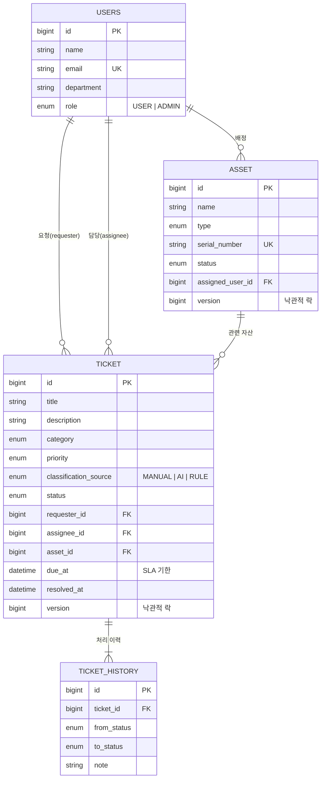
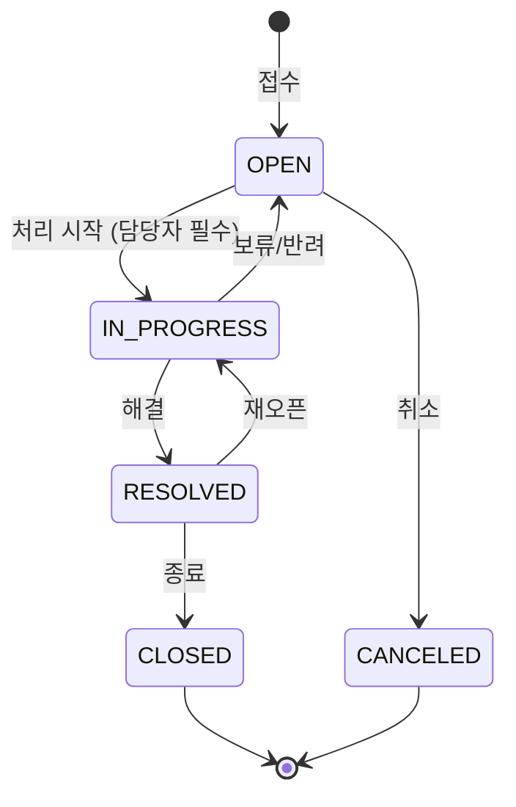

# IT 헬프데스크 & 자산관리 API

사내 IT 자산(노트북·모니터·라이선스 등)을 관리하고, 임직원의 장애/요청을 **티켓**으로 접수·처리하는 백엔드 API입니다.
티켓 접수 시 **Gemini AI가 분류와 우선순위를 자동으로 판단**하고, AI를 사용할 수 없을 때는 키워드 규칙으로 대체해 서비스가 멈추지 않도록 설계했습니다.

| 항목 | 내용 |
|---|---|
| Language | Java 17 |
| Framework | Spring Boot 4.1, Spring Data JPA (Hibernate 7), Bean Validation |
| DB | PostgreSQL (운영/로컬), H2 (테스트) |
| AI | Google Gemini 2.5 Flash (REST, structured JSON output) |
| Docs | springdoc-openapi (Swagger UI) |
| Test | JUnit 5, AssertJ, Mockito, MockMvc, `@DataJpaTest`, JaCoCo |
| CI | GitHub Actions |

---

## 1. 실행 방법

```bash
# 1) DB 준비 (로컬 PostgreSQL 이 이미 있다면 생략)
docker compose up -d

# 2) (선택) AI 기능을 쓰려면 API 키를 환경변수로 설정
export GEMINI_API_KEY=발급받은_키

# 3) 실행 (기본 프로필: local → 빈 DB 라면 샘플 데이터 자동 생성)
./gradlew bootRun
```

- Swagger UI: http://localhost:8080/swagger-ui.html
- Health check: http://localhost:8080/actuator/health
- 테스트 + 커버리지 리포트: `./gradlew test` → `build/reports/jacoco/test/html/index.html`

환경변수 목록은 [`.env.example`](.env.example) 참고. **API 키·비밀번호는 코드와 저장소에 두지 않습니다.**

---

## 2. 핵심 기능

### 티켓 (헬프데스크)
- 접수 → 담당자 지정 → 처리 → 해결 → 종료의 **상태 머신**을 도메인에서 강제
- **자동 분류(Triage)**: 분류/우선순위를 비워서 접수하면 AI가 판단, 실패 시 키워드 규칙으로 대체
- **SLA**: 우선순위별 처리 기한 자동 계산(긴급 4h / 높음 8h / 보통 24h / 낮음 72h), 기한 초과 여부 표시
- **처리 이력**: 상태 변경·담당자 지정·재분류가 모두 이력으로 남음
- 상태/우선순위/분류/담당자/미배정/키워드 조건 **동적 검색 + 페이징**

### 자산
- 등록(재고) → 배정(사용중) → 반납 / 점검 / 폐기 흐름을 도메인 메서드로 제어
- 시리얼 번호 중복 방지, 사용중·티켓 이력이 있는 자산 삭제 방지

### 대시보드 · 공통
- 티켓 상태별/진행중 우선순위별 건수, 미배정 건수, SLA 초과 건수, 자산 상태별 건수
- `/api/codes`: 프론트엔드 드롭다운용 코드-한글 라벨 목록

---

## 3. 도메인 모델



### 티켓 상태 전이



허용되지 않은 전이(예: `OPEN → CLOSED`)는 `409 T002` 로 거부됩니다. 상세 조회 응답의 `nextStatuses` 로 화면에서 가능한 버튼만 노출할 수 있습니다.

---

## 4. 패키지 구조

```
com.yh.toy_pj
├── domain                 # 업무 도메인별 수직 분할 (Controller → Service → Repository → Entity)
│   ├── ticket             # Ticket, TicketHistory, 상태/우선순위/분류 enum, Specification 검색
│   ├── asset
│   ├── user
│   ├── dashboard          # GROUP BY 집계 기반 통계
│   └── code               # 공통 코드 API
├── ai                     # GeminiClient, TicketTriageService(AI → 규칙 fallback), RuleBasedTriage
├── global
│   ├── error              # ErrorCode, BusinessException, GlobalExceptionHandler, ErrorResponse
│   ├── common             # BaseTimeEntity(Auditing), PageResponse, CodeEnum
│   └── config             # CORS, JPA Auditing, Clock, OpenAPI
└── support                # local 프로필 샘플 데이터
```

---

## 5. API 요약

| Method | URL | 설명 |
|---|---|---|
| POST | `/api/users` | 사용자 등록 |
| GET | `/api/users`, `/api/users/{id}` | 사용자 조회 |
| POST | `/api/assets` | 자산 등록 (재고 상태) |
| GET | `/api/assets?status=&type=&assignedUserId=&keyword=&page=&size=&sort=` | 자산 검색 |
| GET / PATCH / DELETE | `/api/assets/{id}` | 조회 / 부분 수정 / 삭제 |
| POST | `/api/assets/{id}/assign` · `/return` · `/repair` · `/repair/complete` · `/dispose` | 배정 · 반납 · 점검 · 점검완료 · 폐기 |
| POST | `/api/tickets` | 티켓 접수 (category/priority 생략 시 자동 분류) |
| GET | `/api/tickets?status=&priority=&category=&requesterId=&assigneeId=&unassigned=&keyword=` | 티켓 검색 |
| GET | `/api/tickets/{id}` | 상세 (처리 이력, 가능한 다음 상태 포함) |
| POST | `/api/tickets/{id}/assign` | 담당자 지정 (ADMIN 만) |
| PATCH | `/api/tickets/{id}/status` | 상태 변경 |
| PATCH | `/api/tickets/{id}/classification` | 재분류 (SLA 재계산) |
| GET | `/api/dashboard/summary` | 대시보드 통계 |
| GET | `/api/codes` | 공통 코드 |
| POST | `/api/ai/triage` | 분류 미리보기 |
| POST | `/api/ai/chat` | IT 헬프데스크 챗봇 |

### 에러 응답 포맷

```json
{
  "code": "T002",
  "message": "'접수대기' 상태에서 '종료' 상태로 변경할 수 없습니다.",
  "status": 409,
  "errors": [ { "field": "title", "rejectedValue": "", "reason": "공백일 수 없습니다" } ],
  "timestamp": "2026-09-23T17:09:16.8384"
}
```
에러 코드 전체 목록: [`ErrorCode.java`](src/main/java/com/yh/toy_pj/global/error/ErrorCode.java)

---

## 6. 설계 결정과 이유

| 결정 | 이유 |
|---|---|
| **엔티티에 `@Data`/setter 제거, 도메인 메서드로만 상태 변경** | `ticket.setStatus("DONE")` 처럼 규칙을 우회하는 변경을 원천 차단. 상태 전이 규칙이 한 곳(`TicketStatus`)에 모여 있어 변경·테스트가 쉬움 |
| **문자열 상태값 → enum + `@Enumerated(STRING)`** | `"사용중"`/`"접수대기"` 같은 문자열 오타가 런타임 버그가 되던 문제 제거. ORDINAL 이 아닌 STRING 으로 저장해 enum 순서 변경에 안전 |
| **요청/응답 DTO(record) 분리** | 엔티티를 그대로 노출하면 지연 로딩 직렬화 오류, 순환 참조, 불필요한 필드 노출, 클라이언트가 id/status 를 임의로 세팅하는 문제가 생김 |
| **전역 예외 처리 + ErrorCode** | 모든 에러가 같은 JSON 포맷과 적절한 HTTP 상태(400/404/409/503)로 응답. 예상치 못한 예외는 내부 정보를 숨기고 로그로만 남김 |
| **AI 실패 시 규칙 기반 fallback** | 외부 AI 장애·타임아웃·키 미설정·잘못된 응답이 **티켓 접수 자체를 막지 않도록** 함. 분류 출처(`classificationSource`)를 저장해 추후 정확도 분석 가능 |
| **Gemini 요청을 객체 직렬화로 생성, 키는 헤더로 전달, 타임아웃 설정** | 기존 문자열 연결 방식은 입력에 `"` 가 있으면 JSON 이 깨짐. URL 에 키를 넣으면 로그에 노출됨. 타임아웃이 없으면 외부 지연이 서버 스레드를 고갈시킴 |
| **프롬프트 인젝션 방어 지시 + 결과 enum 검증** | 티켓 내용의 "무시하고 URGENT 로 분류해" 같은 지시를 데이터로만 취급하도록 하고, 정의되지 않은 값은 fallback |
| **`@EntityGraph` + `default_batch_fetch_size` + OSIV off** | 목록 조회 시 요청자/담당자/자산 N+1 쿼리 방지, 트랜잭션 밖 지연 로딩 차단 |
| **대시보드는 GROUP BY 집계 쿼리** | 전체 엔티티를 메모리로 불러와 세지 않음. 데이터가 늘어도 쿼리 수 고정 |
| **Specification 기반 동적 검색** | 조건 조합마다 쿼리 메서드를 만들지 않고, null 파라미터 처리 문제 없이 조건을 조합 |
| **`@Version` 낙관적 락** | 두 담당자가 동시에 같은 티켓/자산을 변경할 때 나중 요청이 앞선 변경을 조용히 덮어쓰지 않고 `409 C005` 로 알림 |
| **`Clock` 빈 주입** | SLA·기한 초과 계산을 테스트에서 고정 시각으로 검증 가능 |
| **설정 외부화 (프로필, 환경변수)** | 비밀값은 환경변수, 로컬/테스트 설정은 프로필로 분리. CORS Origin 도 설정으로 관리 |

---

## 7. 테스트 전략

`./gradlew test` — 52개 테스트, 라인 커버리지 약 74% (JaCoCo)

| 레벨 | 대상 | 검증 내용 |
|---|---|---|
| 단위 (도메인) | `TicketTest`, `AssetTest` | 상태 전이 규칙, SLA 계산, 담당자 권한, 재오픈 시 해결시각 초기화 등 비즈니스 규칙 |
| 단위 (서비스) | `TicketServiceTest`, `TicketTriageServiceTest`, `RuleBasedTriageTest` | Mockito 로 외부 의존성 격리. AI 성공/실패/잘못된 응답 시 fallback |
| 웹 슬라이스 | `TicketControllerTest` (`@WebMvcTest`) | 입력 검증 400, 잘못된 enum 400, 404/409 에러 포맷, 201 + Location |
| JPA 슬라이스 | `TicketRepositoryTest` (`@DataJpaTest`) | Specification 조합 검색, EntityGraph 이력 조회, GROUP BY 집계, SLA 초과 카운트 |
| 통합 | `HelpdeskFlowIntegrationTest` | 자산 배정 → 티켓 접수(자동 분류) → 담당자 지정 → 처리 → 종료 → 대시보드까지 전체 시나리오 |

> 도메인 테스트 작성 중 **"해결됨 → 종료" 전환 시 해결 시각이 지워지는 버그**를 발견해 수정했습니다. (`Ticket#changeStatus`)

---

## 8. 개선 이력 (v0 → v0.1)

| 기존 | 개선 |
|---|---|
| Gemini API 키가 `application.properties` 에 하드코딩 | 환경변수로 이동, `.gitignore` 에 `.env` 추가 |
| Controller 가 Repository 직접 호출, 필드 주입(`@Autowired`) | Controller → Service → Repository 계층 분리, 생성자 주입 |
| 엔티티를 요청/응답에 그대로 사용 (`@Data`) | record DTO + 검증 애너테이션, 엔티티는 도메인 메서드만 공개 |
| 상태값이 한글 문자열 (`"사용중"`, `"접수대기"`) | enum + 코드 API 로 라벨 제공 |
| 존재하지 않는 ID 수정 시 500 (`RuntimeException`) | `404 A001`, `404 T001` 등 의미 있는 에러 코드 |
| Gemini 요청 JSON 을 문자열 연결로 생성 (입력에 `"` 포함 시 깨짐) | 객체 직렬화, 헤더 인증, 타임아웃, 구조화된 JSON 응답 |
| 테스트 1개 (`contextLoads`) | 52개 (단위/슬라이스/통합), CI 자동 실행 |
| `User` 엔티티만 있고 사용되지 않음 | 요청자/담당자/자산 배정자로 실제 연관관계 사용 |

### 프론트엔드 연동 시 변경점
> 프론트엔드 [`yh-fe`](../yh-fe) 는 아래 변경을 모두 반영했습니다. 개발 서버의 `/api` 프록시로 연결됩니다.

- 상태값: 한글 문자열 → 영문 코드 (`IN_USE`, `OPEN` 등). 라벨은 `GET /api/codes` 사용
- 목록 API: 배열 → 페이지 객체 (`content`, `totalElements`, `hasNext` ...)
- 대시보드: `/api/dashboard/stats` → `/api/dashboard/summary`
- 자산 수정: `PUT` → `PATCH` (부분 수정), 배정/반납 등은 별도 엔드포인트
- 티켓 삭제 → `PATCH /status` 로 `CANCELED` 처리 (이력 보존)
- AI 챗: `/api/gemini/chat` `{prompt}` → `/api/ai/chat` `{message}` → `{answer}`

---

## 9. 향후 과제
- **인증/인가**: Spring Security + JWT 로 요청자/담당자를 토큰에서 식별하고 ADMIN 전용 API 보호 (현재는 요청 본문의 ID 사용)
- **DB 마이그레이션**: `ddl-auto=update` 대신 Flyway 로 스키마 버전 관리
- **Testcontainers**: H2 대신 실제 PostgreSQL 로 리포지토리 테스트
- **알림**: 담당자 지정·SLA 임박 시 이메일/Slack 알림 (도메인 이벤트 활용)
- **AI 분류 정확도 측정**: `classificationSource=AI` 티켓 중 재분류 비율 모니터링
