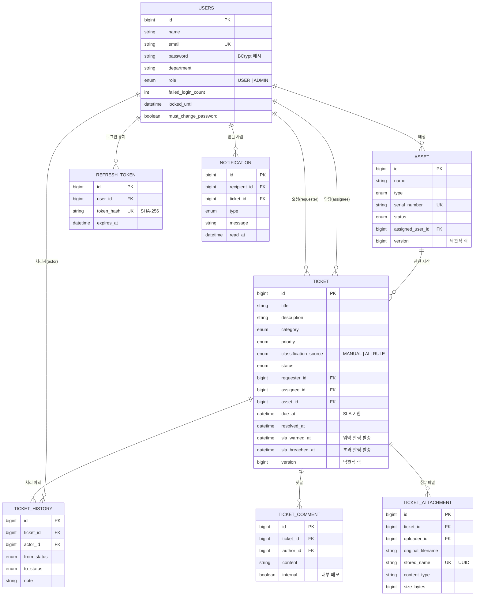
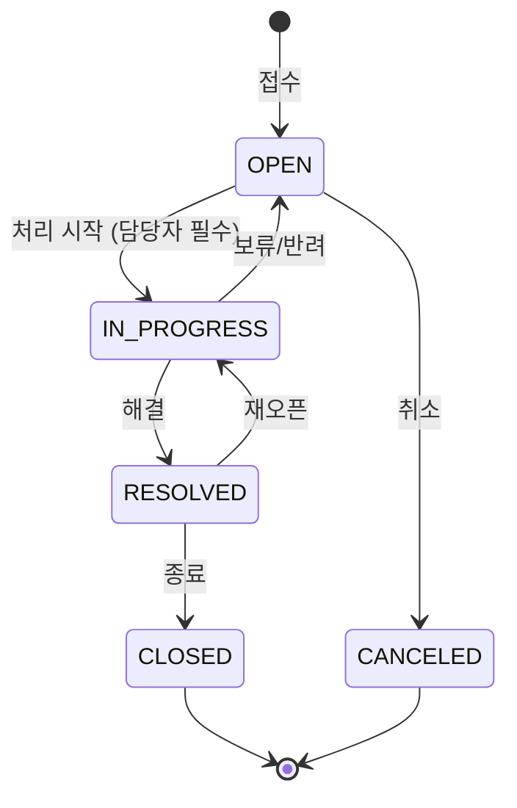

# 도메인 모델과 패키지 구조



### 티켓 상태 전이



허용되지 않은 전이(예: `OPEN → CLOSED`)는 `409 T002` 로 거부됩니다. 상세 조회 응답의 `nextStatuses` 로 화면에서 가능한 버튼만 노출할 수 있습니다.

## 패키지 구조

```
com.yh.toy_pj
├── domain                 # 업무 도메인별 수직 분할 (Controller → Service → Repository → Entity)
│   ├── ticket             # Ticket, TicketHistory, 상태/우선순위/분류 enum, Specification 검색
│   │   ├── comment        # 댓글 / 내부 메모
│   │   └── attachment     # 첨부파일 (파일 형식 검증, 저장소 연동)
│   ├── asset
│   ├── user
│   ├── dashboard          # GROUP BY 집계 기반 통계
│   └── code               # 공통 코드 API
├── auth                   # 로그인/재발급/로그아웃, JWT 발급·검증 필터, refresh token(해시 저장)
├── notification           # 앱 내 알림, 티켓 이벤트 리스너, SLA 점검(SlaMonitor), 스케줄러, Slack 발송
├── ai                     # GeminiClient, TicketTriageService(AI → 규칙 fallback), RuleBasedTriage
├── global
│   ├── error              # ErrorCode, BusinessException, GlobalExceptionHandler, ErrorResponse
│   ├── security           # SecurityConfig(URL 권한 규칙), 401/403 응답 처리
│   ├── logging            # RequestIdFilter (요청 ID → MDC·응답 헤더·에러 응답, 접근 로그)
│   ├── storage            # FileStorage 추상화 + LocalFileStorage
│   ├── common             # BaseTimeEntity(Auditing), PageResponse, CodeEnum
│   └── config             # JPA Auditing(Clock 기준), Clock, OpenAPI, Scheduling
└── support                # local 프로필 샘플 데이터
```

---

### DB 스키마 버전 관리 (Flyway)

테이블 구조는 `src/main/resources/db/migration` 의 SQL 파일로만 관리합니다.

```
db/migration                         ← 앱 시작 시 Flyway 가 아직 적용 안 된 파일만 순서대로 실행
├── V1__init_schema.sql              사용자, 자산, 티켓, 처리 이력, refresh token
├── V2__account_security.sql         로그인 실패 횟수·잠금, 비밀번호 변경 관련 컬럼
├── V3__ticket_comment_attachment.sql 댓글, 첨부파일
├── V4__notification_sla.sql         알림, SLA 알림 발송 기록 컬럼
└── V5__normalize_user_email.sql     기존 이메일을 소문자로 통일
```

- 실행 이력은 `flyway_schema_history` 테이블에 남습니다. 어느 서버든 "지금 DB 가 몇 번 버전인지" 알 수 있습니다.
- Hibernate 는 `ddl-auto=validate` 로 **엔티티와 테이블이 일치하는지 검증만** 합니다. 불일치하면 앱이 뜨지 않습니다.
- 테스트도 **실제 PostgreSQL 컨테이너**에 같은 마이그레이션을 적용해 스키마를 만들어, SQL 과 엔티티가 어긋나면 테스트가 실패합니다.
- **이미 적용된 파일은 수정하지 않습니다.** 변경이 필요하면 V2~V5 처럼 새 파일을 추가합니다. 기존 운영 DB 에도 데이터 손실 없이 순서대로 적용됩니다.


---
[← README](../README.md)
