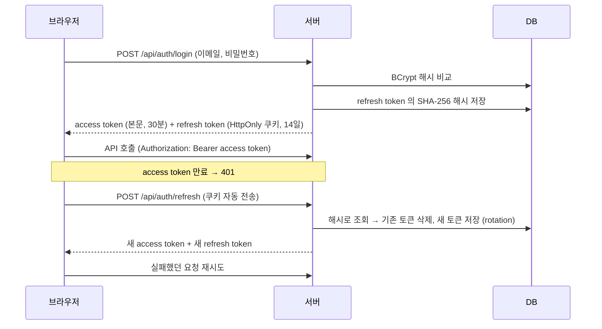

# 인증 · 보안

### 로그인 흐름

### DB 에는 해시만 저장

| 값 | 저장 방식 | 이유 |
|---|---|---|
| 비밀번호 | **BCrypt** (`{bcrypt}$2a$10$...`) | 사람이 정한 값이라 추측 가능 → 일부러 느린 해시 + 사용자마다 다른 salt 로 대입 공격을 어렵게 함. 같은 비밀번호도 해시가 매번 다름 |
| refresh token | **SHA-256** (64자리) | 서버가 만든 256비트 무작위 값이라 추측 불가 → 빠른 해시로 충분하고, 값이 고정이라 DB 인덱스로 바로 조회 가능 |
| access token | 저장 안 함 | 서명(HS256)으로 위변조를 검증하므로 서버가 보관할 필요 없음 (STATELESS) |

DB 가 유출되더라도 해시로는 원래 비밀번호나 토큰을 알아낼 수 없습니다.

### 로그인 시도 제한 · 비밀번호 관리

| 기능 | 동작 |
|---|---|
| **로그인 시도 제한** | 같은 계정으로 **5번 연속** 틀리면 **15분 잠금** (`423 AUTH005`). 잠긴 동안에는 맞는 비밀번호도 거절. 성공하면 실패 횟수 초기화 |
| **비밀번호 변경** | 현재 비밀번호를 다시 확인 → 변경 후 **다른 기기의 로그인(refresh token)은 모두 폐기**, 지금 기기에만 새 토큰 발급 |
| **관리자 비밀번호 초기화** | 12자리 임시 비밀번호 발급 (응답에서 **한 번만** 확인 가능, DB 에는 해시). 잠금 해제 + 기존 로그인 폐기 + 다음 로그인 때 **변경 강제** |
| **관리자 잠금 해제** | 15분을 기다리지 않고 즉시 해제 |

> 트레이드오프: 잠금 안내(423)는 "이 이메일의 계정이 존재한다"는 사실을 드러냅니다. 계정 존재 여부를 완전히 숨기는 것보다, 사용자가 왜 로그인이 안 되는지 알 수 있는 쪽을 택했습니다.

### 발급된 access token 을 서버가 무효화하는 방법

JWT 는 서버가 저장하지 않아 원래는 만료(30분) 전까지 취소할 수 없습니다. 그래서 요청마다 **사용자 PK 로 컬럼 2개만 조회**해 다음을 확인합니다. (`AccessTokenVerifier`)

| 상황 | 처리 |
|---|---|
| 토큰 발급 이후 비밀번호가 바뀜 (본인 변경, 관리자 초기화) | 그 전에 받은 토큰은 `401` → 프론트가 재발급 시도 → refresh token 도 폐기되어 있어 로그인 화면으로 |
| 임시 비밀번호 상태 (`mustChangePassword`) | 비밀번호 변경·내 정보·로그아웃 외의 API 는 `403 AUTH008` (프론트 화면 이동만으로는 API 직접 호출을 막을 수 없으므로 서버에서도 차단) |

> 트레이드오프: "DB 조회 없는 STATELESS 검증"의 장점 일부를 포기하고 보안을 택했습니다. PK 조회 1번이라 비용은 작고, 트래픽이 커지면 캐시(Redis)로 옮길 수 있습니다.

### refresh token 은 한 번만 사용
재발급 시 기존 토큰을 삭제하고, **삭제된 행 수가 1일 때만** 새 토큰을 발급합니다. 같은 토큰으로 동시에 두 번 요청해도 하나만 성공합니다.

### 권한

| 기능 | 일반 사용자(USER) | IT 관리자(ADMIN) |
|---|---|---|
| 티켓 접수 | O (요청자 = 로그인 사용자, **우선순위는 자동 분류**) | O (분류·우선순위 직접 지정 가능) |
| 티켓 조회 | **본인이 요청한 티켓만** | 전체 |
| 티켓 상태 변경 | 본인 티켓 **취소만** | 전체 (허용된 전이) |
| 담당자 지정 · 재분류 | X | O |
| 자산 조회 | **본인에게 배정된 자산만** | 전체 |
| 자산 등록 · 배정 · 폐기 | X | O |
| 댓글 | 본인 티켓에 작성·조회 | 전체 + **내부 메모**(요청자에게 안 보임) |
| 첨부파일 | 본인 티켓에 업로드·다운로드, 본인 파일 삭제 | 전체 |
| 알림 | 본인 알림만 | 본인 알림만 |
| 대시보드 · 사용자 관리 · 비밀번호 초기화 | X | O |

- URL 단위 규칙은 `SecurityConfig`, "본인 데이터만" 같은 데이터 단위 규칙은 서비스/도메인에서 검사합니다.
- 로그인 안 함 → `401 AUTH001`, 권한 없음 → `403 AUTH004`, 임시 비밀번호 상태 → `403 AUTH008` (다른 에러와 같은 JSON 포맷)
- 처리 이력에는 **누가** 변경했는지(처리자)가 함께 기록됩니다.

---
[← README](../README.md)
